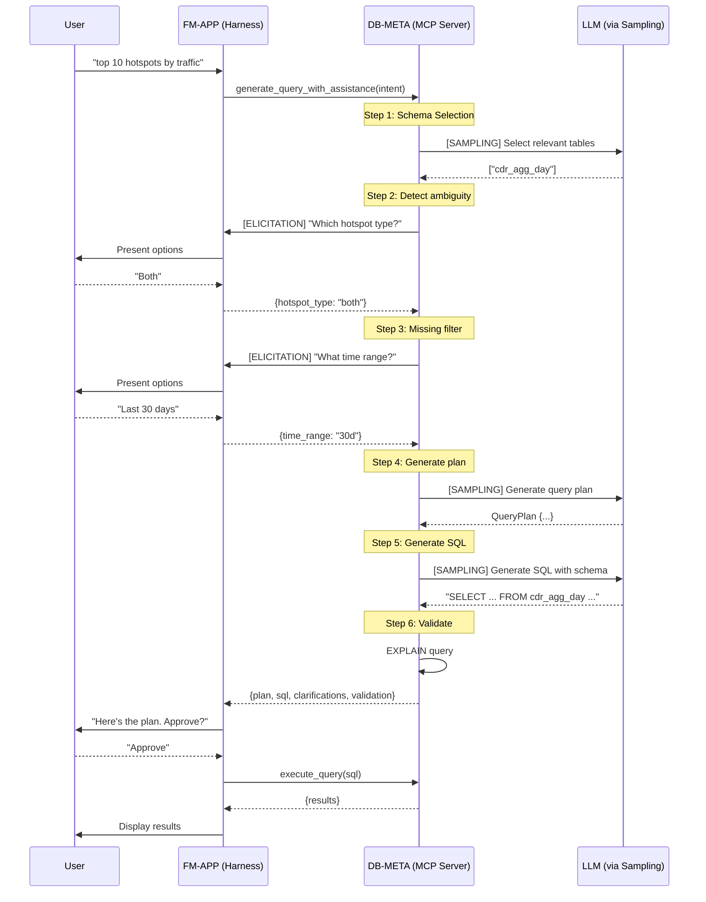

# MCP Elicitation, Sampling & UI Integration for DB-Meta

## Overview

This document explores how new MCP specification features - **Elicitation**, **Sampling**, and **MCP UI/Apps** - can enhance db-meta's capabilities and shift intelligence from the orchestration harness (fm-app) into the database context layer (db-meta).

### MCP Feature Summary

| Feature | Direction | Purpose |
|---------|-----------|---------|
| **Elicitation** | Server → Client → User | Server requests user input mid-operation (JSON Schema forms) |
| **Sampling** | Server → Client → LLM | Server requests LLM completion from client |
| **MCP UI/Apps** | Server → Client | Server delivers rich interactive UI components with responses |

These features enable MCP servers to be more autonomous - they can ask questions, reason about data, and deliver rich visual experiences without the harness orchestrating every step.

---

## Current Architecture vs MCP-Enhanced Architecture

### Current: Harness-Driven

```
┌─────────────────────────────────────────────────────────────────────────────┐
│                           FM-APP (Harness)                                  │
│                                                                             │
│  User Request ──► Intent Analysis ──► Planning ──► SQL Gen ──► Execution   │
│       │                │                 │            │            │        │
│       │                │                 │            │            │        │
│       ▼                ▼                 ▼            ▼            ▼        │
│   [LLM Call]      [LLM Call]        [LLM Call]   [LLM Call]    [Query]     │
│                                                                             │
│                         All LLM reasoning happens in harness                │
└─────────────────────────────────────────────────────────────────────────────┘
                                      │
                                      │ MCP Tools (passive)
                                      ▼
┌─────────────────────────────────────────────────────────────────────────────┐
│                           DB-META (MCP Server)                              │
│                                                                             │
│   prompt_items_v2() ──► Returns schema, instructions (no reasoning)         │
│   validate_plan()   ──► Returns valid/invalid (no reasoning)                │
│   preflight_query() ──► Returns EXPLAIN result (no reasoning)               │
│                                                                             │
│                         Passive data provider only                          │
└─────────────────────────────────────────────────────────────────────────────┘
```

**Limitations:**
- All intelligence in harness - db-meta is "dumb" data provider
- Harness must anticipate all clarification needs upfront
- Schema selection is pure RAG (no reasoning about relationships)
- No iterative exploration within db-meta

### Target: MCP-Enhanced (Elicitation + Sampling)

```
┌─────────────────────────────────────────────────────────────────────────────┐
│                           FM-APP (Harness)                                  │
│                                                                             │
│  User Request ──► Call db-meta tool ──► Handle responses ──► Present result│
│                                                                             │
│                    Thin orchestration - delegates to db-meta                │
└─────────────────────────────────────────────────────────────────────────────┘
           │                              ▲
           │ MCP Tool Call                │ Response (may include elicitation/sampling)
           ▼                              │
┌─────────────────────────────────────────────────────────────────────────────┐
│                           DB-META (MCP Server)                              │
│                                                                             │
│   generate_query_plan(intent)                                               │
│       │                                                                     │
│       ├──► [SAMPLING] Ask LLM: "Which tables are relevant?"                 │
│       │         └──► LLM reasons about schema + domain model                │
│       │                                                                     │
│       ├──► [ELICITATION] Ask User: "Did you mean X or Y?"                   │
│       │         └──► User clarifies ambiguous term                          │
│       │                                                                     │
│       ├──► [SAMPLING] Ask LLM: "Generate SQL for this plan"                 │
│       │         └──► LLM generates SQL with full schema context             │
│       │                                                                     │
│       └──► Return: {plan, sql, clarifications_made}                         │
│                                                                             │
│                    Intelligent reasoning within MCP server                  │
└─────────────────────────────────────────────────────────────────────────────┘
```

**Benefits:**
- DB-meta becomes a "database expert agent"
- Harness is simpler, more replaceable
- Schema reasoning happens where schema knowledge lives
- Clarification can happen at the right moment (when ambiguity detected)

---

## MCP Elicitation Use Cases for DB-Meta

### 1. Ambiguous Table Resolution

When multiple tables could satisfy a query:

```python
@mcp.tool()
async def generate_query_plan(intent: str, ctx: Context) -> QueryPlan:
    # Find candidate tables
    candidates = search_tables(intent)
    
    if len(candidates) > 1 and ambiguity_score(candidates) > 0.7:
        # ELICITATION: Ask user to clarify
        response = await ctx.elicit(
            message="I found multiple tables that could work:",
            schema={
                "type": "object",
                "properties": {
                    "table_choice": {
                        "type": "string",
                        "enum": [c.name for c in candidates],
                        "description": format_table_options(candidates)
                    }
                }
            }
        )
        selected_table = response["table_choice"]
    else:
        selected_table = candidates[0].name
    
    # Continue with selected table...
```

**User Experience:**
```
User: "Show me subscriber activity"

DB-Meta (via elicitation): 
  "I found multiple tables that could work:
   - subs: Current subscriber state (plan, status)
   - cdr_agg_day: Subscriber network activity (traffic, sessions)
   - subs_item_action_logs: Subscriber actions (upgrades, changes)
   
   Which one matches what you're looking for?"

User: "cdr_agg_day"

DB-Meta: [continues with cdr_agg_day]
```

### 2. Missing Filter Clarification

When a query would be expensive without filters:

```python
@mcp.tool()
async def generate_sql(plan: QueryPlan, ctx: Context) -> GeneratedSQL:
    # Check if query needs time filter
    if is_large_table(plan.primary_table) and not has_time_filter(plan):
        response = await ctx.elicit(
            message="This table has billions of rows. What time range?",
            schema={
                "type": "object",
                "properties": {
                    "time_range": {
                        "type": "string",
                        "enum": ["last_7_days", "last_30_days", "last_90_days", "custom"],
                    },
                    "custom_start": {"type": "string", "format": "date"},
                    "custom_end": {"type": "string", "format": "date"}
                }
            }
        )
        plan.filters.append(create_time_filter(response))
    
    # Generate SQL with filter...
```

### 3. Column Disambiguation

When a column name exists in multiple tables with different meanings:

```python
async def resolve_column(column_name: str, tables: list[str], ctx: Context) -> str:
    matches = find_column_in_tables(column_name, tables)
    
    if len(matches) > 1:
        response = await ctx.elicit(
            message=f"'{column_name}' exists in multiple tables:",
            schema={
                "type": "object",
                "properties": {
                    "column_choice": {
                        "type": "string",
                        "enum": [f"{m.table}.{m.column}" for m in matches],
                        "description": format_column_options(matches)
                    }
                }
            }
        )
        return response["column_choice"]
    
    return matches[0].full_name
```

### 4. Credential Collection (URL Mode)

For multi-tenant scenarios connecting to customer databases:

```python
@mcp.tool()
async def connect_database(profile: str, ctx: Context) -> ConnectionResult:
    if not has_valid_credentials(profile):
        # URL mode elicitation - opens browser for OAuth
        response = await ctx.elicit(
            message="Please authenticate to access this database",
            schema={
                "type": "object",
                "properties": {
                    "auth_url": {
                        "type": "string",
                        "format": "uri",
                        "x-elicitation-mode": "url"  # Triggers browser flow
                    }
                }
            },
            url=generate_oauth_url(profile)
        )
        # Credentials now stored server-side via OAuth callback
    
    return connect_with_credentials(profile)
```

---

## MCP Sampling Use Cases for DB-Meta

### 1. Intelligent Schema Selection

Instead of RAG top-k, use LLM reasoning:

```python
@mcp.tool()
async def get_relevant_schema(intent: str, ctx: Context) -> SchemaSubset:
    # Get all tables (lightweight)
    all_tables = get_table_list()  # names + descriptions only
    
    # SAMPLING: Ask LLM to select relevant tables
    response = await ctx.sample(
        messages=[
            {"role": "system", "content": SCHEMA_SELECTION_PROMPT},
            {"role": "user", "content": f"""
                User intent: {intent}
                
                Available tables:
                {format_table_list(all_tables)}
                
                Select the most relevant tables for this query.
                Return JSON: {{"tables": ["table1", "table2"]}}
            """}
        ],
        max_tokens=500
    )
    
    selected_tables = parse_table_selection(response)
    
    # Now fetch full schema for only selected tables
    return get_full_schema(selected_tables)
```

**Why this is better than RAG:**
- LLM can reason about relationships ("need both subscriber and usage tables")
- Can use domain knowledge ("hotspot traffic needs cdr_agg_day, not cdrs")
- Handles semantic gaps ("TMO" → T-Mobile → cdr_type filter)

### 2. SQL Generation with Full Context

DB-meta generates SQL internally with sampling:

```python
@mcp.tool()
async def generate_sql(plan: QueryPlan, ctx: Context) -> GeneratedSQL:
    # Fetch full schema for plan tables
    schema = await get_table_details(plan.tables)
    
    # Get SQL dialect rules
    dialect = get_sql_dialect(plan.database)
    
    # Get domain-specific instructions
    instructions = get_domain_instructions(plan.database)
    
    # SAMPLING: Generate SQL
    response = await ctx.sample(
        messages=[
            {"role": "system", "content": f"""
                You are a SQL expert for {dialect.name}.
                
                Schema:
                {format_schema(schema)}
                
                Rules:
                {instructions}
            """},
            {"role": "user", "content": f"""
                Generate SQL for this plan:
                {format_plan(plan)}
            """}
        ],
        max_tokens=2000
    )
    
    sql = extract_sql(response)
    
    # Validate before returning
    validation = await validate_sql(sql)
    if not validation.valid:
        # Self-correct with another sampling call
        sql = await self_correct_sql(sql, validation.errors, ctx)
    
    return GeneratedSQL(sql=sql, explanation=response)
```

### 3. Query Explanation

Generate human-readable explanations:

```python
@mcp.tool()
async def explain_query(query_id: str, ctx: Context) -> QueryExplanation:
    query = get_query(query_id)
    
    # SAMPLING: Generate explanation
    response = await ctx.sample(
        messages=[
            {"role": "system", "content": "Explain SQL queries in plain English."},
            {"role": "user", "content": f"""
                Explain what this query does:
                
                ```sql
                {query.sql}
                ```
                
                Target audience: Business user (non-technical)
            """}
        ],
        max_tokens=500
    )
    
    return QueryExplanation(
        query_id=query_id,
        explanation=response,
        tables_used=query.tables,
        filters_applied=extract_filters(query.sql)
    )
```

### 4. Embedded Mini-Agent for Schema Exploration

DB-meta can run its own exploration loop:

```python
@mcp.tool()
async def explore_schema_for_question(question: str, ctx: Context) -> SchemaRecommendation:
    """
    Autonomous schema exploration using sampling for reasoning.
    """
    explored_tables = []
    findings = []
    
    for iteration in range(MAX_EXPLORATION_STEPS):
        # SAMPLING: Decide next exploration step
        response = await ctx.sample(
            messages=[
                {"role": "system", "content": SCHEMA_EXPLORER_PROMPT},
                {"role": "user", "content": f"""
                    Question: {question}
                    
                    Tables explored so far: {explored_tables}
                    Findings: {findings}
                    
                    What should I explore next? Options:
                    1. Explore a new table (specify which)
                    2. Check relationships between tables
                    3. Done - I have enough information
                    
                    Return JSON action.
                """}
            ],
            max_tokens=300
        )
        
        action = parse_action(response)
        
        if action.type == "explore_table":
            table_info = get_table_details([action.table])
            explored_tables.append(action.table)
            findings.append(f"Table {action.table}: {summarize(table_info)}")
            
        elif action.type == "check_relationships":
            relationships = get_foreign_keys(action.tables)
            findings.append(f"Relationships: {relationships}")
            
        elif action.type == "done":
            break
    
    # Final recommendation
    return SchemaRecommendation(
        question=question,
        recommended_tables=explored_tables,
        reasoning=findings,
        suggested_joins=infer_joins(explored_tables)
    )
```

---

## MCP UI/Apps: Rich Interactive Interfaces

### Overview

While **Elicitation** provides JSON Schema-based forms for user input, **MCP UI/Apps** enables servers to deliver fully interactive HTML/JavaScript components that render inside the host application. This is a game-changer for data-rich applications like db-meta.

**Key Insight**: MCP UI solves the "custom UI vs portability" tradeoff. The UI travels with the data, not hardcoded in the client application.

### How MCP UI Works

```
┌─────────────────────────────────────────────────────────────────────────────────────┐
│                              MCP Server (db-meta)                                   │
│                                                                                     │
│   Tool Response:                                                                    │
│   {                                                                                 │
│     "content": [                                                                    │
│       { "type": "text", "text": "Query results for top 10 hotspots" },              │
│       {                                                                             │
│         "type": "resource",                                                         │
│         "resource": {                                                               │
│           "uri": "ui://db-meta/data-grid",                                          │
│           "mimeType": "text/html",                                                  │
│           "text": "<html>...interactive data grid...</html>"                        │
│         }                                                                           │
│       }                                                                             │
│     ]                                                                               │
│   }                                                                                 │
│                                                                                     │
└─────────────────────────────────────────────────────────────────────────────────────┘
                                        │
                                        │ MCP Response
                                        ▼
┌─────────────────────────────────────────────────────────────────────────────────────┐
│                         MCP Client (Claude, ChatGPT, etc.)                          │
│                                                                                     │
│   Renders UI resource in sandboxed iframe:                                          │
│   ┌───────────────────────────────────────────────────────────────────────────────┐ │
│   │  ┌─────────────────────────────────────────────────────────────────────────┐  │ │
│   │  │  Hotspot ID  │  Traffic (GB)  │  Sessions  │  Avg Speed  │  Status   ▼ │  │ │
│   │  ├─────────────────────────────────────────────────────────────────────────┤  │ │
│   │  │  HS-001      │  1,234.5       │  45,230    │  125 Mbps   │  Active     │  │ │
│   │  │  HS-002      │  987.3         │  32,100    │  98 Mbps    │  Active     │  │ │
│   │  │  HS-003      │  876.2         │  28,450    │  112 Mbps   │  Warning    │  │ │
│   │  │  ...         │  ...           │  ...       │  ...        │  ...        │  │ │
│   │  └─────────────────────────────────────────────────────────────────────────┘  │ │
│   │  [Export CSV]  [Show Chart]  [Filter...]                                      │ │
│   └───────────────────────────────────────────────────────────────────────────────┘ │
│                                                                                     │
│   Bidirectional communication via postMessage (JSON-RPC)                            │
│                                                                                     │
└─────────────────────────────────────────────────────────────────────────────────────┘
```

### UIResource Structure

```typescript
interface UIResource {
  type: 'resource';
  resource: {
    uri: string;           // ui://db-meta/component-name
    mimeType: 'text/html' | 'text/uri-list' | 'application/vnd.mcp-ui.remote-dom';
    text?: string;         // Inline HTML content
    blob?: string;         // Base64-encoded alternative
  };
}
```

**Delivery Methods:**
- `text/html` - Inline HTML rendered via `<iframe srcdoc="...">`
- `text/uri-list` - Remote URL loaded via `<iframe src="...">`
- `application/vnd.mcp-ui.remote-dom` - JSON-based component tree rendered by host

### MCP UI Use Cases for DB-Meta

#### 1. Query Results Visualization

Instead of returning raw JSON that the client must format:

```python
@mcp.tool()
async def execute_query(sql: str, ctx: Context) -> ToolResult:
    results = await run_query(sql)
    
    # Generate interactive data grid
    ui_html = render_data_grid(
        data=results.rows,
        columns=results.columns,
        features=["sort", "filter", "export", "pagination"]
    )
    
    return ToolResult(content=[
        TextContent(text=f"Query returned {len(results.rows)} rows"),
        UIResource(
            uri="ui://db-meta/query-results",
            mimeType="text/html",
            text=ui_html
        )
    ])
```

**Benefits:**
- Sorting, filtering, pagination work client-side (no round-trips)
- Export to CSV/Excel built into the component
- Consistent UX across Claude, ChatGPT, any MCP host

#### 2. Query Plan Approval with Visual Diagram

```python
@mcp.tool()
async def generate_query_plan(intent: str, ctx: Context) -> ToolResult:
    plan = await create_plan(intent)
    
    # Generate visual plan diagram with approval buttons
    ui_html = render_plan_approval(
        plan=plan,
        tables=plan.tables,
        joins=plan.joins,
        filters=plan.filters,
        actions=["approve", "modify", "reject"]
    )
    
    return ToolResult(content=[
        TextContent(text=f"Generated plan for: {intent}"),
        UIResource(
            uri="ui://db-meta/plan-approval",
            mimeType="text/html",
            text=ui_html
        )
    ])
```

**Visual Plan Diagram:**
```
┌──────────────────────────────────────────────────────────────────────┐
│                         Query Plan                                   │
│                                                                      │
│   ┌─────────────┐         ┌─────────────┐         ┌─────────────┐   │
│   │ cdr_agg_day │───JOIN──│  hotspots   │         │   Result    │   │
│   │  (1M rows)  │         │  (10K rows) │────────►│  (top 10)   │   │
│   └─────────────┘         └─────────────┘         └─────────────┘   │
│         │                                                            │
│         │ Filters:                                                   │
│         ├─ time >= 2024-01-01                                        │
│         └─ cdr_type = 'wifi'                                         │
│                                                                      │
│   ┌──────────┐  ┌──────────┐  ┌──────────┐                          │
│   │ Approve  │  │  Modify  │  │  Reject  │                          │
│   └──────────┘  └──────────┘  └──────────┘                          │
└──────────────────────────────────────────────────────────────────────┘
```

#### 3. Table Disambiguation with Rich Previews

Instead of simple text options (elicitation), show table previews:

```python
@mcp.tool()
async def select_table(candidates: list[str], ctx: Context) -> ToolResult:
    # Fetch preview data for each candidate
    previews = [get_table_preview(t) for t in candidates]
    
    # Generate rich selection UI
    ui_html = render_table_picker(
        tables=[{
            "name": t.name,
            "description": t.description,
            "columns": t.columns[:5],  # First 5 columns
            "row_count": t.row_count,
            "sample_rows": t.sample[:3]  # 3 sample rows
        } for t in previews]
    )
    
    return ToolResult(content=[
        TextContent(text="Multiple tables match your query. Please select:"),
        UIResource(
            uri="ui://db-meta/table-picker",
            mimeType="text/html",
            text=ui_html
        )
    ])
```

**Table Picker UI:**
```
┌──────────────────────────────────────────────────────────────────────┐
│  Which table matches your intent?                                    │
│                                                                      │
│  ┌────────────────────────────────────────────────────────────────┐  │
│  │ 📊 cdr_agg_day                                          SELECT │  │
│  │ Daily aggregated network activity per subscriber                │  │
│  │ Columns: date, subscriber_id, total_volume, sessions, ...      │  │
│  │ ~500M rows │ Updated: 2 hours ago                               │  │
│  │ ┌────────┬─────────────┬────────────┐                          │  │
│  │ │ date   │ subscriber  │ volume_gb  │  (sample)                │  │
│  │ │ 2024.. │ sub_123     │ 2.5        │                          │  │
│  │ └────────┴─────────────┴────────────┘                          │  │
│  └────────────────────────────────────────────────────────────────┘  │
│                                                                      │
│  ┌────────────────────────────────────────────────────────────────┐  │
│  │ 📊 subscriber_actions                                   SELECT │  │
│  │ Subscriber plan changes and actions                             │  │
│  │ Columns: timestamp, subscriber_id, action_type, details, ...   │  │
│  │ ~50M rows │ Updated: 1 hour ago                                 │  │
│  └────────────────────────────────────────────────────────────────┘  │
└──────────────────────────────────────────────────────────────────────┘
```

#### 4. Schema Explorer

Interactive schema browsing within the chat:

```python
@mcp.tool()
async def explore_schema(profile: str, ctx: Context) -> ToolResult:
    schema = get_full_schema(profile)
    
    ui_html = render_schema_explorer(
        tables=schema.tables,
        relationships=schema.foreign_keys,
        features=["search", "expand_columns", "show_relationships"]
    )
    
    return ToolResult(content=[
        TextContent(text=f"Schema for {profile}:"),
        UIResource(
            uri="ui://db-meta/schema-explorer",
            mimeType="text/html",
            text=ui_html
        )
    ])
```

#### 5. Query Builder (Advanced)

Visual query construction for complex queries:

```python
@mcp.tool()
async def open_query_builder(tables: list[str], ctx: Context) -> ToolResult:
    schema = get_schema_for_tables(tables)
    
    ui_html = render_query_builder(
        tables=schema,
        features=["drag_drop_columns", "visual_joins", "filter_builder"]
    )
    
    return ToolResult(content=[
        TextContent(text="Build your query visually:"),
        UIResource(
            uri="ui://db-meta/query-builder",
            mimeType="text/html",
            text=ui_html
        )
    ])
```

### Bidirectional Communication

UI components can send events back to the MCP server:

```javascript
// Inside the UI component (iframe)
import { sendAction } from '@mcp-ui/client';

// User clicks "Approve" button
approveButton.onclick = () => {
  sendAction({
    type: 'plan_approved',
    payload: { plan_id: 'abc123' }
  });
};

// User modifies a filter
filterInput.onchange = (e) => {
  sendAction({
    type: 'filter_updated',
    payload: { column: 'date', value: e.target.value }
  });
};
```

The host receives these events and can:
1. Forward to the MCP server for processing
2. Trigger follow-up tool calls
3. Update the conversation context

### Security Model

MCP UI uses defense-in-depth:

1. **Sandboxed iframes** - UI runs in isolated context, no access to host DOM
2. **Pre-reviewed templates** - UI resources use `ui://` URIs registered in advance
3. **Structured messaging** - All communication via JSON-RPC, auditable
4. **User consent** - Host can require approval before rendering external UIs

### Comparison: Elicitation vs MCP UI

| Aspect | Elicitation | MCP UI |
|--------|-------------|--------|
| **Complexity** | Simple forms (JSON Schema) | Full HTML/JS applications |
| **Interactivity** | Submit once | Continuous interaction |
| **Visualization** | None | Charts, tables, diagrams |
| **Use case** | "Pick an option" | "Explore this data" |
| **Implementation** | Built into MCP spec | Extension (MCP Apps) |
| **Client support** | Broader | Requires UI-capable host |

**When to use which:**
- **Elicitation**: Simple choices, confirmations, text input
- **MCP UI**: Data visualization, complex workflows, rich exploration

### Implementation for DB-Meta

#### Server-Side (Python)

```python
from mcp_ui_server import create_ui_resource

def render_data_grid(data: list[dict], columns: list[str]) -> str:
    """Generate interactive data grid HTML."""
    return f"""
    <!DOCTYPE html>
    <html>
    <head>
        <script src="https://cdn.example.com/mcp-ui-components.js"></script>
        <style>/* grid styles */</style>
    </head>
    <body>
        <mcp-data-grid 
            data='{json.dumps(data)}'
            columns='{json.dumps(columns)}'
            sortable="true"
            filterable="true"
            exportable="true">
        </mcp-data-grid>
        <script>
            // Handle user actions
            document.querySelector('mcp-data-grid').addEventListener('action', (e) => {
                window.parent.postMessage({
                    jsonrpc: '2.0',
                    method: 'ui/action',
                    params: e.detail
                }, '*');
            });
        </script>
    </body>
    </html>
    """

@mcp.tool()
async def execute_query(sql: str) -> list:
    results = await run_query(sql)
    
    ui_resource = create_ui_resource(
        uri="ui://db-meta/query-results",
        content={"type": "raw_html", "htmlString": render_data_grid(results.rows, results.columns)},
        encoding="text"
    )
    
    return [
        {"type": "text", "text": f"Returned {len(results.rows)} rows"},
        ui_resource
    ]
```

#### Component Library Strategy

Build a library of reusable UI components for db-meta:

```
db-meta/ui-components/
├── data-grid/           # Sortable, filterable data table
├── plan-diagram/        # Query plan visualization
├── table-picker/        # Table selection with previews
├── schema-explorer/     # Interactive schema browser
├── query-builder/       # Visual query construction
├── chart-viewer/        # Basic charts (bar, line, pie)
└── shared/
    ├── styles.css       # Consistent theming
    └── mcp-bridge.js    # Host communication utilities
```

### Adoption Path

| Phase | Focus | Components |
|-------|-------|------------|
| **Phase 1** | Query results | Data grid with sort/filter/export |
| **Phase 2** | Plan approval | Visual plan diagram with actions |
| **Phase 3** | Table selection | Rich table picker with previews |
| **Phase 4** | Schema exploration | Interactive schema browser |
| **Phase 5** | Query building | Visual query constructor |

---

## SQL Query Generation Flow with MCP Features

### Complete Flow Diagram

```
┌──────────────────────────────────────────────────────────────────────────────────────┐
│                                USER REQUEST                                          │
│                     "Show me top 10 hotspots by traffic"                             │
└──────────────────────────────────────────────────────────────────────────────────────┘
                                        │
                                        ▼
┌──────────────────────────────────────────────────────────────────────────────────────┐
│                              FM-APP (Harness)                                        │
│                                                                                      │
│   1. Receive user request                                                            │
│   2. Call db-meta: generate_query_with_assistance(intent)                            │
│   3. Handle elicitation callbacks (present questions to user)                        │
│   4. Present final result to user                                                    │
└──────────────────────────────────────────────────────────────────────────────────────┘
                                        │
                                        │ MCP Tool Call
                                        ▼
┌──────────────────────────────────────────────────────────────────────────────────────┐
│                              DB-META (MCP Server)                                    │
│                                                                                      │
│   generate_query_with_assistance(intent: "top 10 hotspots by traffic")               │
│                                        │                                             │
│   ┌────────────────────────────────────┴────────────────────────────────────┐        │
│   │                                                                          │        │
│   │  STEP 1: Schema Selection [SAMPLING]                                     │        │
│   │  ────────────────────────────────────                                    │        │
│   │                                                                          │        │
│   │  ctx.sample("Given intent and table list, select relevant tables")       │        │
│   │       │                                                                  │        │
│   │       └──► LLM Response: ["cdr_agg_day", "wifi_hotspots"]                │        │
│   │                                                                          │        │
│   └──────────────────────────────────────────────────────────────────────────┘        │
│                                        │                                             │
│   ┌────────────────────────────────────┴────────────────────────────────────┐        │
│   │                                                                          │        │
│   │  STEP 2: Ambiguity Check [ELICITATION]                                   │        │
│   │  ─────────────────────────────────────                                   │        │
│   │                                                                          │        │
│   │  Detected: "hotspots" could mean greenfield or brownfield                │        │
│   │                                                                          │        │
│   │  ctx.elicit("Which hotspot type?",                                       │        │
│   │             options=["Greenfield (HMH)", "Brownfield (Plus)", "Both"])   │        │
│   │       │                                                                  │        │
│   │       └──► User Response: "Both"                                         │        │
│   │                                                                          │        │
│   └──────────────────────────────────────────────────────────────────────────┘        │
│                                        │                                             │
│   ┌────────────────────────────────────┴────────────────────────────────────┐        │
│   │                                                                          │        │
│   │  STEP 3: Time Range Check [ELICITATION]                                  │        │
│   │  ──────────────────────────────────────                                  │        │
│   │                                                                          │        │
│   │  cdr_agg_day is large table, no time filter specified                    │        │
│   │                                                                          │        │
│   │  ctx.elicit("What time range?",                                          │        │
│   │             options=["Last 7 days", "Last 30 days", "All time"])         │        │
│   │       │                                                                  │        │
│   │       └──► User Response: "Last 30 days"                                 │        │
│   │                                                                          │        │
│   └──────────────────────────────────────────────────────────────────────────┘        │
│                                        │                                             │
│   ┌────────────────────────────────────┴────────────────────────────────────┐        │
│   │                                                                          │        │
│   │  STEP 4: Plan Generation [SAMPLING]                                      │        │
│   │  ──────────────────────────────────                                      │        │
│   │                                                                          │        │
│   │  ctx.sample("Generate query plan with these parameters...")              │        │
│   │       │                                                                  │        │
│   │       └──► LLM Response: QueryPlan {                                     │        │
│   │              tables: [cdr_agg_day],                                      │        │
│   │              filters: [time >= now-30d, cdr_type='wifi'],                │        │
│   │              group_by: [hotspot_id],                                     │        │
│   │              order_by: [traffic DESC],                                   │        │
│   │              limit: 10                                                   │        │
│   │            }                                                             │        │
│   │                                                                          │        │
│   └──────────────────────────────────────────────────────────────────────────┘        │
│                                        │                                             │
│   ┌────────────────────────────────────┴────────────────────────────────────┐        │
│   │                                                                          │        │
│   │  STEP 5: SQL Generation [SAMPLING]                                       │        │
│   │  ─────────────────────────────────                                       │        │
│   │                                                                          │        │
│   │  Fetch full schema for cdr_agg_day                                       │        │
│   │  ctx.sample("Generate SQL for this plan with this schema...")            │        │
│   │       │                                                                  │        │
│   │       └──► LLM Response:                                                 │        │
│   │            SELECT                                                        │        │
│   │              CASE WHEN agw_sn = 'brownfield'                             │        │
│   │                   THEN telco_id ELSE agw_sn END AS hotspot_id,           │        │
│   │              SUM(total_volume) / 1e9 AS traffic_gb                       │        │
│   │            FROM dwh.public.cdr_agg_day                                   │        │
│   │            WHERE creation_time >= CURRENT_DATE - INTERVAL '30' DAY       │        │
│   │              AND cdr_type = 'wifi'                                       │        │
│   │            GROUP BY 1                                                    │        │
│   │            ORDER BY traffic_gb DESC                                      │        │
│   │            LIMIT 10                                                      │        │
│   │                                                                          │        │
│   └──────────────────────────────────────────────────────────────────────────┘        │
│                                        │                                             │
│   ┌────────────────────────────────────┴────────────────────────────────────┐        │
│   │                                                                          │        │
│   │  STEP 6: Validation (No LLM)                                             │        │
│   │  ───────────────────────────                                             │        │
│   │                                                                          │        │
│   │  Run EXPLAIN to validate SQL                                             │        │
│   │  Check estimated cost                                                    │        │
│   │       │                                                                  │        │
│   │       └──► Valid, estimated 1M rows scanned                              │        │
│   │                                                                          │        │
│   └──────────────────────────────────────────────────────────────────────────┘        │
│                                        │                                             │
│   RETURN: {                                                                          │
│     plan: QueryPlan,                                                                 │
│     sql: "SELECT ...",                                                               │
│     clarifications: [                                                                │
│       {question: "hotspot type", answer: "Both"},                                    │
│       {question: "time range", answer: "Last 30 days"}                               │
│     ],                                                                               │
│     validation: {valid: true, estimated_rows: 1000000}                               │
│   }                                                                                  │
│                                                                                      │
└──────────────────────────────────────────────────────────────────────────────────────┘
                                        │
                                        ▼
┌──────────────────────────────────────────────────────────────────────────────────────┐
│                              FM-APP (Harness)                                        │
│                                                                                      │
│   Present plan to user for approval:                                                 │
│   "I'll show top 10 hotspots (greenfield + brownfield) by traffic                    │
│    from the last 30 days. Proceed?"                                                  │
│                                                                                      │
└──────────────────────────────────────────────────────────────────────────────────────┘
```

---

## Sequence Diagram (Mermaid)



---

## Implementation Considerations

### 1. Elicitation Design Principles

```python
# Good: Specific, actionable options
await ctx.elicit(
    message="The term 'subscriber' could mean different things:",
    schema={
        "type": "object",
        "properties": {
            "subscriber_type": {
                "type": "string",
                "enum": ["helium_mobile_only", "all_carriers", "specific_carrier"],
                "description": """
                    - helium_mobile_only: Helium Mobile subscribers (have subscriber_id)
                    - all_carriers: All users on the network (use user_name_id)
                    - specific_carrier: Filter by carrier realm
                """
            }
        }
    }
)

# Bad: Vague, open-ended
await ctx.elicit(
    message="What do you mean by subscriber?",
    schema={"type": "string"}  # Too open-ended
)
```

### 2. Sampling Cost Control

```python
# Control sampling costs
await ctx.sample(
    messages=[...],
    max_tokens=500,  # Limit response size
    model_preferences={
        "hints": ["fast"],  # Prefer faster/cheaper model
        "cost_priority": 0.8  # Prioritize cost over quality
    }
)

# For complex reasoning, allow more
await ctx.sample(
    messages=[...],
    max_tokens=2000,
    model_preferences={
        "hints": ["reasoning"],  # Prefer capable model
        "cost_priority": 0.3
    }
)
```

### 3. Caching Sampling Results

```python
@cached(ttl=3600, key=lambda intent, tables: hash(intent, tuple(tables)))
async def select_tables_with_sampling(intent: str, tables: list, ctx: Context):
    """Cache LLM table selection for repeated similar queries."""
    return await ctx.sample(...)
```

### 4. Graceful Degradation

```python
async def generate_query(intent: str, ctx: Context):
    try:
        # Try smart path with sampling
        tables = await select_tables_with_sampling(intent, ctx)
    except SamplingUnavailable:
        # Fall back to RAG if sampling not supported
        tables = await rag_select_tables(intent)
    
    try:
        # Try to clarify ambiguity
        await clarify_with_elicitation(intent, tables, ctx)
    except ElicitationUnavailable:
        # Fall back to best-guess with assumptions
        log.info("Elicitation unavailable, using default assumptions")
```

---

## Benefits Summary

| Aspect | Current (Harness-Driven) | With Elicitation + Sampling |
|--------|--------------------------|------------------------------|
| Schema Selection | RAG top-k (can miss relevant tables) | LLM reasoning about relationships |
| Ambiguity Handling | Upfront in intent analysis | At point of detection, contextual |
| SQL Generation | Harness calls LLM | DB-meta calls LLM with full schema context |
| Harness Complexity | High (all logic) | Low (just orchestration) |
| Replaceability | Hard (contains intelligence) | Easy (just MCP client) |
| Clarification Timing | Before processing | During processing, when needed |

---

## Migration Path

### Phase 1: Add Elicitation Support
- Implement elicitation in db-meta for table/time disambiguation
- Harness handles elicitation callbacks
- No sampling yet (LLM calls still in harness)

### Phase 2: Add Sampling for Schema Selection
- Replace RAG table selection with sampling
- Keep SQL generation in harness

### Phase 3: Move SQL Generation to DB-Meta
- Full sampling-based SQL generation in db-meta
- Harness becomes thin orchestration layer

### Phase 4: Embedded Agent Loops
- DB-meta can run multi-step exploration
- Self-correcting SQL generation
- Harness is fully replaceable

---

## Related Documents

- `docs/future/autonomous-agentic-flow.md` - FM-APP agent architecture
- `docs/future/db-meta-v2-architecture.md` - DB-Meta as Database Context Layer
- [MCP Elicitation Specification](https://modelcontextprotocol.io/specification/draft/client/elicitation)
- [MCP Sampling Specification](https://spec.modelcontextprotocol.io/specification/2025-03-26/client/sampling/)
- [MCP Apps Blog Post](https://blog.modelcontextprotocol.io/posts/2025-11-21-mcp-apps/) - Official announcement
- [MCP-UI Documentation](https://mcpui.dev/guide/introduction) - Implementation guide
- [MCP-UI GitHub](https://github.com/idosal/mcp-ui) - SDKs and examples
- [Shopify MCP UI Article](https://shopify.engineering/mcp-ui-breaking-the-text-wall) - Real-world adoption
