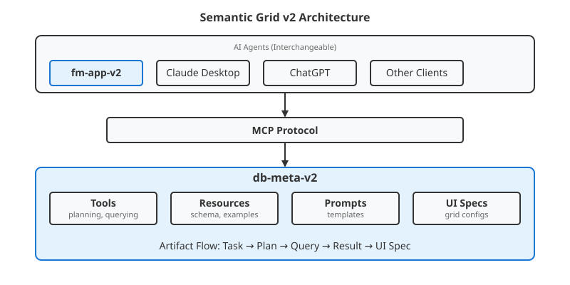
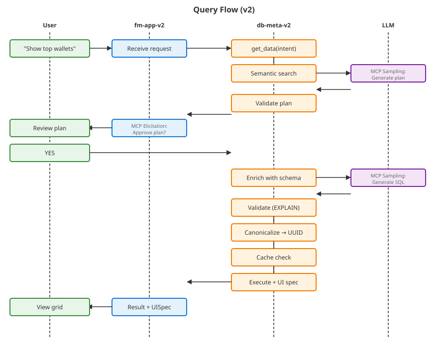
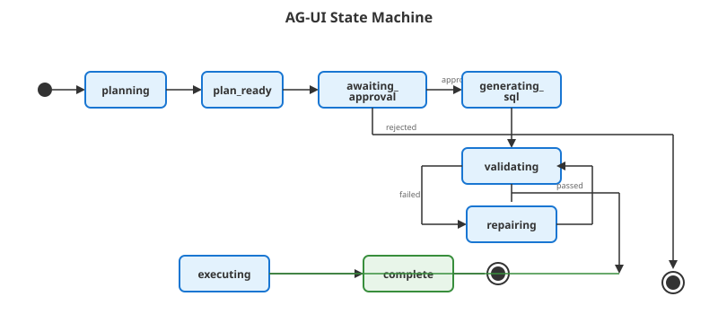
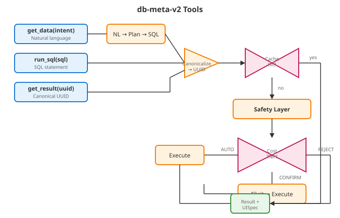
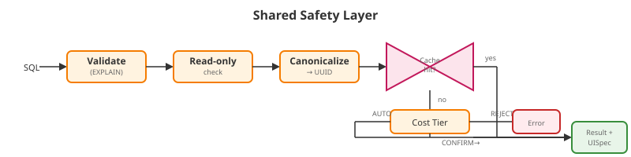
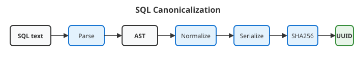
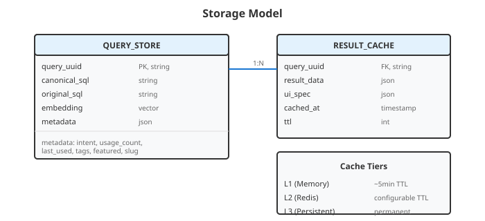
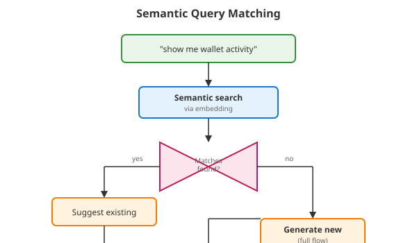

# Semantic Grid v2 Architecture

## Overview

This document outlines the proposed v2 architecture for Semantic Grid, featuring a redesigned separation of concerns between fm-app and db-meta, built on PydanticAI and leveraging MCP's sampling and elicitation capabilities.

## Vision

### Core Principles

1. **fm-app-v2** becomes a specialized AI agent for databases and UI grids
2. **fm-app-v2** should be swappable with any MCP-compatible AI agent (Claude Desktop, ChatGPT, etc.) - core functionality preserved, UX degraded without specialized grid support
3. **db-meta-v2** becomes the centerpiece of database semantics and intelligence, exposed via MCP
4. **db-meta-v2** owns UI features (grid specs, chart suggestions) exposed via MCP
5. **db-meta-v2** is pluggable alongside other MCP servers

### Responsibility Split

| Component | Owns | Artifacts |
|-----------|------|-----------|
| **fm-app-v2** | Users, sessions, messages, specialized grid UX | Conversations, user preferences |
| **db-meta-v2** | Database semantics, query intelligence, UI specs | Tasks, plans, queries, grid configs |

## Architecture Diagram



## MCP Features Leveraged

### Sampling (Server-Initiated LLM Calls)

Sampling allows MCP servers to request LLM completions through the client. This enables db-meta-v2 to:

- Generate query plans using the client's LLM
- Generate SQL using the client's LLM
- Remain model-agnostic (client chooses the model)

**Flow:**
1. Server sends `sampling/createMessage` request to client
2. Client reviews/modifies the request (human-in-the-loop)
3. Client calls its LLM
4. Client returns result to server

**Key:** Sampling is transport-agnostic - works over both stdio and Streamable HTTP.

### Elicitation (Server-Initiated User Input)

Elicitation allows servers to request structured input from users:

- Plan approval ("Should I use these tables?")
- Clarification ("Which time range?")
- Confirmation ("Execute this query?")

**Limitations:**
- Only primitive types supported (string, number, boolean, enum)
- Complex approvals may need custom UI in fm-app-v2

### References

- [MCP Sampling Specification](https://modelcontextprotocol.io/specification/2025-11-25/client/sampling)
- [MCP Elicitation Specification](https://modelcontextprotocol.io/specification/2025-11-25/client/elicitation)
- [MCP Transports](https://modelcontextprotocol.io/specification/2025-11-25/basic/transports) - confirms sampling/elicitation are transport-agnostic

## Technology Stack: PydanticAI

### Why PydanticAI?

PydanticAI is a Python agent framework from the Pydantic team with:

- **Model-agnostic** - OpenAI, Anthropic, Gemini, custom providers
- **Type-safe** - Full IDE support, `Agent[DepsType, OutputType]`
- **Structured outputs** - Pydantic models as output types, auto-validated
- **Native MCP support** - Both as client and server
- **Dependency injection** - `RunContext[DepsType]` for type-safe deps
- **Graph workflows** - `pydantic-graph` for state machines
- **Durability** - Temporal integration for production

### MCP Integration

**As MCP Client (fm-app-v2):**
```python
from pydantic_ai import Agent
from pydantic_ai.mcp import MCPServerStreamableHTTP

db_meta = MCPServerStreamableHTTP('http://localhost:8000/mcp')
agent = Agent('anthropic:claude-sonnet', toolsets=[db_meta])

async with db_meta:
    result = await agent.run('Show me top wallets by volume')
```

**As MCP Server with Sampling (db-meta-v2):**
```python
from fastmcp import FastMCP
from pydantic_ai import Agent
from pydantic_ai.models.mcp_sampling import MCPSamplingModel

server = FastMCP('db-meta')
planner = Agent(MCPSamplingModel(), output_type=QueryPlan)

@server.tool()
async def generate_query_plan(intent: str, schema: str) -> QueryPlan:
    # Uses CLIENT's LLM via MCP sampling
    result = await planner.run(f"Plan: {intent}\nSchema: {schema}")
    return result.output
```

### References

- [PydanticAI Documentation](https://ai.pydantic.dev/)
- [PydanticAI MCP Client](https://ai.pydantic.dev/mcp/client/)
- [PydanticAI MCP Server](https://ai.pydantic.dev/mcp/server/)
- [PydanticAI Graph](https://ai.pydantic.dev/graph/)
- [PydanticAI Temporal Integration](https://ai.pydantic.dev/durable_execution/temporal/)

## Proposed Query Flow (v2)



## Monorepo Structure (v2 alongside v1)

```
apps/
├── fm-app/              # v1 - current FastAPI + Celery
├── fm-app-v2/           # v2 - PydanticAI agent (NEW)
├── db-meta/             # v1 - current FastMCP server
├── db-meta-v2/          # v2 - MCP server with sampling (NEW)
├── web/                 # frontend (works with both)
└── cms/                 # unchanged

packages/
├── resources/           # shared prompt packs
├── client-configs/      # shared tenant configs
└── sg-models/           # NEW: shared Pydantic models
    ├── pyproject.toml
    └── src/sg_models/
        ├── task.py      # Task, TaskStatus
        ├── plan.py      # QueryPlan, PlanValidation
        ├── query.py     # QueryResult, QueryMetadata
        └── ui.py        # GridSpec, ColumnSpec, ChartSpec
```

## Implementation Decisions

### 1. Build Order

**Start with db-meta-v2.**

- It's the "brain" of the new architecture
- Can be tested with Claude Desktop before fm-app-v2 exists
- Forces correct MCP interface design
- fm-app-v2 becomes simpler once db-meta-v2's contract is defined

**Validation:** Connect Claude Desktop to db-meta-v2, generate SQL through natural language.

### 2. Shared Models Package

**Yes - `packages/sg-models`**

Both apps import shared Pydantic models:
- `QueryPlan`, `PlanValidation`
- `QueryResult`, `QueryMetadata`
- `GridSpec`, `ColumnSpec`, `ChartSpec`

This ensures db-meta-v2 and fm-app-v2 speak the same language.

### 3. API Compatibility

**New API contract, coexisting with v1.**

- fm-app-v2 exposes `/api/v2/` prefix
- Web frontend feature-flags between v1 and v2
- v2 API can be WebSocket-first for streaming
- Eventually sunset v1 routes

### 4. Task Durability

**Start with pydantic-graph, design for Temporal.**

- pydantic-graph is built-in, zero infrastructure
- Good enough for dev/testing
- Design state/nodes to be Temporal-compatible
- Add Temporal when needed: multi-day workflows, crash recovery, distributed execution

Key: Keep nodes/state serializable from day one.

## Swappable Agent Test

When a generic client (Claude Desktop) connects to db-meta-v2:

| Works | Degraded |
|-------|----------|
| Natural language → SQL | No specialized grid rendering |
| Query planning with approval | Generic text/JSON output |
| Schema exploration | No interactive refinement UI |
| Validation and repair | No session persistence |

The **core value** (semantic query generation) lives in db-meta-v2.
The **UX enhancement** lives in fm-app-v2.

## UI Specification (MCP-UI)

db-meta-v2 returns UI specs alongside query results:

```python
{
    "sql": "SELECT ...",
    "data": [...],
    "ui": {
        "type": "datagrid",
        "columns": [
            {"field": "wallet", "type": "address", "formatter": "ethereum"},
            {"field": "balance", "type": "currency", "decimals": 2},
            {"field": "last_active", "type": "datetime", "relative": True}
        ],
        "default_sort": {"field": "balance", "direction": "desc"},
        "grouping": {"enabled": True, "fields": ["chain"]},
        "chart_suggestion": {"type": "bar", "x": "chain", "y": "balance"}
    }
}
```

- **fm-app-v2** interprets UI spec → renders MUI X Data Grid Pro
- **Generic clients** ignore UI spec → show raw data/JSON

## Frontend Protocol: AG-UI

### Why AG-UI?

AG-UI (Agent-User Interaction Protocol) is an open standard from CopilotKit that standardizes how frontend applications communicate with AI agents. It's event-based and designed for streaming state changes - exactly what db-meta-v2 produces.

### The Streaming Model

db-meta-v2's `get_data` tool streams state changes throughout execution:



AG-UI's event types map directly to this:
- `STATE_SNAPSHOT` / `STATE_DELTA` - Progress updates
- `TOOL_CALL_START` / `TOOL_CALL_END` - Tool execution visibility
- Human-in-the-loop interrupts for plan approval

### AG-UI vs Vercel AI SDK

| Aspect | AG-UI | Vercel AI SDK |
|--------|-------|---------------|
| **Design focus** | Agent workflows with state | Chat conversations |
| **State sync** | Native bi-directional (`STATE_DELTA`) | Manual implementation |
| **Event streaming** | Full event protocol | Token streaming |
| **Human-in-the-loop** | Built-in interrupt/resume | `addToolApprovalResponse` |
| **PydanticAI support** | `AGUIAdapter` | `VercelAIAdapter` |
| **Current web app** | Would need adoption | Already installed (`ai` package) |

**Verdict:** AG-UI is the better fit because:
1. State streaming is native, not bolted on
2. Designed for workflow-heavy agents, not just chat
3. Plan approval maps to built-in interrupt pattern
4. PydanticAI has first-class support via `AGUIAdapter`

### Frontend Implementation

```tsx
import { useAgent } from '@copilotkit/react-core';

interface QueryState {
  status: 'idle' | 'planning' | 'awaiting_approval' | 'generating' | 'validating' | 'executing' | 'complete';
  plan?: QueryPlan;
  query?: string;
  result?: QueryResult;
  uiSpec?: GridSpec;
}

function QueryWorkspace() {
  const { state, sendMessage } = useAgent<QueryState>({
    url: '/api/v2/agent',
    initialState: { status: 'idle' }
  });

  return (
    <Box>
      <ChatInput onSend={sendMessage} />
      
      {/* Reactive status - updates automatically as state streams */}
      <QueryStatus status={state.status} />
      
      {/* Plan approval appears when state.status === 'awaiting_approval' */}
      {state.status === 'awaiting_approval' && (
        <PlanApproval plan={state.plan} />
      )}
      
      {/* Grid renders when complete */}
      {state.status === 'complete' && (
        <DataGridPro 
          rows={state.result.data}
          columns={mapUiSpecToColumns(state.uiSpec)}
        />
      )}
    </Box>
  );
}
```

The key: **state flows from agent → UI automatically** via the event stream. No polling, no manual WebSocket wiring.

### Backend Integration (fm-app-v2)

PydanticAI's `AGUIAdapter` handles the protocol:

```python
from pydantic_ai.ui import AGUIAdapter

adapter = AGUIAdapter(agent)

# Starlette/FastAPI endpoint
@app.post("/api/v2/agent")
async def agent_endpoint(request: Request):
    return await adapter.dispatch_request(request)
```

### References

- [AG-UI Protocol](https://docs.ag-ui.com/)
- [AG-UI Overview (CopilotKit)](https://www.copilotkit.ai/ag-ui)
- [PydanticAI AG-UI Integration](https://ai.pydantic.dev/ui/ag-ui/)
- [CopilotKit useAgent Hook](https://www.marktechpost.com/2025/12/11/copilotkit-v1-50-brings-ag-ui-agents-directly-into-your-app-with-the-new-useagent-hook/)

## db-meta-v2 MCP Interface

### Design Principles

1. **Encapsulate complexity** - Clients see simple tools, not internal implementation
2. **Defense in depth** - Read-only enforced at DB level AND validation layer
3. **Cost-aware execution** - Tiered guardrails prevent DB overload
4. **Canonical queries** - SQL normalized to AST, deduplicated by UUID, efficiently cached

### Tools

Three entry points, one unified output: **Result + UISpec**.

| Tool | Input | Entry Point | Description |
|------|-------|-------------|-------------|
| `get_data` | `intent: str` | Natural language | Full flow: NL → Plan → SQL → Result |
| `run_sql` | `sql: str` | SQL statement | Skip NL/planning, same safety layer |
| `get_result` | `query_uuid: str` | Canonical UUID | Fetch cached or execute stored query |



### Shared Safety Layer

All three tools converge through the same safety layer:



### Read-Only Enforcement

Defense in depth - multiple layers ensure no mutations:

1. **DB connection level** - Read-only user/role (primary enforcement)
2. **Validation layer** - Parse and reject non-SELECT statements
3. **EXPLAIN analysis** - Catch anything that slipped through

### Query Cost Tiers

Prevents DB overload by categorizing queries before execution:

| Tier | Criteria | Action |
|------|----------|--------|
| **Auto** | Cache hit, OR (cost < threshold AND rows < limit) | Execute immediately |
| **Confirm** | Cost/rows exceed soft limits, within hard limits | Elicit: "Query scans ~2M rows. Execute?" |
| **Reject** | Exceeds hard limits, likely to timeout | Return error + suggestion to narrow scope |

Cache hits always bypass cost checks - they're free.

### Canonicalization

SQL text is normalized to a canonical AST, producing a deterministic UUID:



Normalization handles:
- Whitespace differences
- Alias naming variations
- Column order (when semantically equivalent)
- Comment stripping
- Literal format normalization

Two semantically identical queries get the same UUID, enabling efficient caching and deduplication.

### Storage Model



- **Query Store**: Persists canonical queries (UUID → SQL mapping)
- **Result Cache**: Caches execution results, tiered by hotness

### Resources

Read-only data clients can fetch for context:

| Resource | URI Pattern | Description |
|----------|-------------|-------------|
| `schema://overview` | Schema overview | Tables, descriptions, domains |
| `schema://tables/{table}` | Table details | Columns, types, relationships |
| `queries://popular` | Popular queries | Most used queries by usage count |
| `queries://featured` | Featured queries | Curated/promoted queries |
| `queries://search?q={query}` | Semantic search | Find similar existing queries |
| `queries://tagged/{tag}` | Tagged queries | Queries by domain/category |
| `cache://stats` | Cache statistics | Hit rates, popular queries |

### Prompts

Reusable prompt templates - both internal and user-facing:

**Internal prompts (used by tools):**

| Prompt | Arguments | Description |
|--------|-----------|-------------|
| `plan_query` | `intent`, `schema` | Generate query plan from intent |
| `generate_sql` | `plan`, `schema` | Generate SQL from approved plan |
| `repair_sql` | `sql`, `error` | Fix SQL based on validation error |

**User-facing prompts (slash commands):**

Curated queries exposed as MCP prompts, surfaced as slash commands in clients:

| Prompt | Slash Command | Description |
|--------|---------------|-------------|
| `top_wallets` | `/top-wallets` | Show top wallets by balance |
| `daily_volume` | `/daily-volume` | Daily transaction volume |
| `whale_activity` | `/whale-activity` | Recent whale movements |

These are dynamically generated from featured queries in the query store.

### Semantic Query Matching

Before generating a new query, `get_data` searches for semantically similar existing queries:



**Flow when matches found:**

```python
# In get_data, before planning
matches = await query_store.semantic_search(intent, limit=5)

if matches and matches[0].score > SIMILARITY_THRESHOLD:
    yield StateEvent(
        status="match_found",
        matches=[{
            "uuid": m.uuid,
            "intent": m.metadata.intent,
            "score": m.score,
            "usage_count": m.metadata.usage_count
        } for m in matches[:3]]
    )
    
    # Elicit: use existing or generate new?
    choice = await ctx.elicit(
        QueryChoiceSchema,
        message="Found similar queries. Use existing or generate new?"
    )
    
    if choice.use_existing:
        await query_store.increment_usage(choice.selected_uuid)
        yield from get_result(choice.selected_uuid)
        return

# No match or user wants new - proceed with generation
yield StateEvent(status="planning")
```

**Benefits:**

1. **Faster results** - Reuse cached queries instead of regenerating
2. **Consistency** - Same question gets same answer
3. **Discovery** - Users find queries they didn't know existed
4. **Usage analytics** - Track which queries are valuable
5. **Slash commands** - Featured queries become one-click actions

## Evaluation Framework: pydantic-evals

### Why pydantic-evals?

Since v2 is built on PydanticAI, **pydantic-evals** is the natural choice for systematic testing and evaluation. It's a code-first framework from the Pydantic team designed for evaluating stochastic (LLM-based) code.

| v2 Requirement | pydantic-evals Feature |
|----------------|------------------------|
| PydanticAI agents | Native integration, same ecosystem |
| SQL generation quality | Custom evaluators (syntax, semantic, logical) |
| MCP tool orchestration | **Span-based evaluation** via OpenTelemetry traces |
| Sampling/elicitation flows | Evaluate internal agent behavior, not just output |
| Multi-step workflows | Trace-aware evals for "how" not just "what" |
| Code-first philosophy | Matches prompt pack / overlay system |

### Core Concepts

- **Dataset**: Collection of test cases for a specific task
- **Case**: Individual test with inputs, expected outputs, metadata
- **Evaluator**: Scoring function (deterministic or LLM-as-judge)
- **Experiment**: Running all cases against a task, collecting results

### Evaluator Types for db-meta-v2

**1. SQL Syntax Evaluator (Deterministic)**

```python
from dataclasses import dataclass
from pydantic_evals.evaluators import Evaluator, EvaluatorContext
import sqlglot

@dataclass
class SQLSyntaxEvaluator(Evaluator):
    """Validates SQL parses correctly with sqlglot."""
    dialect: str = "clickhouse"
    
    async def evaluate(self, ctx: EvaluatorContext[str, QueryResult]) -> float:
        try:
            sqlglot.parse(ctx.output.sql, dialect=self.dialect)
            return 1.0
        except Exception:
            return 0.0
```

**2. Semantic Correctness Evaluator (DB-validated)**

```python
@dataclass
class SemanticCorrectnessEvaluator(Evaluator):
    """Validates tables/columns exist via db-meta."""
    
    async def evaluate(self, ctx: EvaluatorContext[str, QueryResult]) -> float:
        validation = await validate_plan_against_schema(ctx.output.sql)
        if not validation.valid:
            return 0.0
        # Partial credit for warnings
        return 1.0 - (0.1 * len(validation.warnings))
```

**3. Intent Match Evaluator (LLM-as-Judge)**

```python
@dataclass
class IntentMatchEvaluator(Evaluator):
    """LLM judges whether SQL implements user intent."""
    
    async def evaluate(self, ctx: EvaluatorContext[str, QueryResult]) -> float:
        prompt = f"""
        User intent: {ctx.inputs}
        Generated SQL: {ctx.output.sql}
        Expected SQL: {ctx.expected_output.sql}
        
        Score 0.0-1.0 how well the generated SQL implements the intent.
        Consider: correct tables, joins, filters, aggregations, output columns.
        """
        # Use LLM to score
        result = await judge_agent.run(prompt)
        return result.output.score
```

**4. Workflow Evaluator (Span-Based)**

Critical for evaluating MCP sampling/elicitation flows:

```python
@dataclass
class WorkflowEvaluator(Evaluator):
    """Evaluate agent took correct steps via OpenTelemetry spans."""
    required_steps: list[str] = ("plan_query", "validate_plan", "generate_sql")
    
    async def evaluate(self, ctx: EvaluatorContext) -> float:
        spans = ctx.spans  # Access trace data
        steps_taken = [s.name for s in spans]
        matched = len(set(self.required_steps) & set(steps_taken))
        return matched / len(self.required_steps)
```

### Dataset Structure

```python
from pydantic_evals import Case, Dataset

# Load from existing query examples
dataset = Dataset(
    cases=[
        Case(
            name="top_wallets_by_volume",
            inputs="Show me top 10 wallets by trading volume",
            expected_output=QueryResult(
                sql="SELECT wallet, SUM(volume) as total_volume FROM transactions GROUP BY wallet ORDER BY total_volume DESC LIMIT 10"
            ),
            metadata={"category": "aggregation", "tables": ["transactions"]}
        ),
        Case(
            name="daily_active_users",
            inputs="How many unique users were active each day last week?",
            expected_output=QueryResult(
                sql="SELECT DATE(timestamp) as day, COUNT(DISTINCT user_id) as dau FROM events WHERE timestamp >= now() - INTERVAL 7 DAY GROUP BY day ORDER BY day"
            ),
            metadata={"category": "time_series", "tables": ["events"]}
        ),
        # ... more cases from query_examples.yaml
    ],
    evaluators=[
        SQLSyntaxEvaluator(),
        SemanticCorrectnessEvaluator(),
        IntentMatchEvaluator(),
        WorkflowEvaluator(),
    ]
)
```

### Running Evals

```python
from sg_models import QueryResult

async def get_data_task(intent: str) -> QueryResult:
    """The task being evaluated - wraps db-meta-v2's get_data tool."""
    async with db_meta_client as client:
        result = await client.call_tool("get_data", {"intent": intent})
        return QueryResult.model_validate(result)

# Run evaluation
report = await dataset.evaluate(get_data_task)
report.print(include_input=True, include_output=True)

# Or sync version
report = dataset.evaluate_sync(get_data_task)
```

### Eval Directory Structure

```
apps/db-meta-v2/evals/
├── __init__.py
├── conftest.py                   # shared fixtures, db connections
├── evaluators/
│   ├── __init__.py
│   ├── sql_syntax.py             # sqlglot validation
│   ├── semantic.py               # schema validation
│   ├── intent_match.py           # LLM-as-judge
│   └── workflow.py               # span-based process evals
├── datasets/
│   ├── get_data.yaml             # NL → SQL test cases
│   ├── run_sql.yaml              # SQL validation cases
│   ├── repair_loop.yaml          # error recovery cases
│   └── edge_cases.yaml           # error handling, timeouts
└── run_evals.py                  # CLI entry point

apps/fm-app-v2/evals/
├── evaluators/
│   └── ui_spec.py                # GridSpec correctness
└── datasets/
    └── rendering.yaml            # UI interpretation cases
```

### Key Metrics

| Metric | Measures | Evaluator |
|--------|----------|-----------|
| **Syntax Pass Rate** | SQL parseability | SQLSyntaxEvaluator |
| **Semantic Pass Rate** | Valid table/column refs | SemanticCorrectnessEvaluator |
| **Intent Match Score** | User goal achievement | IntentMatchEvaluator |
| **First-Pass Success** | No repair needed | WorkflowEvaluator |
| **Repair Success Rate** | Error recovery | WorkflowEvaluator |
| **Workflow Compliance** | Correct step sequence | WorkflowEvaluator (spans) |

### Logfire Integration

pydantic-evals integrates with Pydantic Logfire for visualization:

```bash
pip install 'pydantic-evals[logfire]'
```

Benefits:
- **Trace visualization** for MCP tool calls
- **Eval dashboards** with score trends over time
- **Comparison views** for A/B testing prompts
- **Token usage tracking** per eval run

Results flow automatically to Logfire when configured, providing:
- Historical score tracking
- Regression detection
- Prompt effectiveness comparison
- Cost analysis per eval run

### CI Integration

```yaml
# .github/workflows/evals.yml
name: Run Evals
on:
  push:
    paths:
      - 'apps/db-meta-v2/**'
      - 'packages/sg-models/**'
  schedule:
    - cron: '0 0 * * *'  # Daily

jobs:
  evals:
    runs-on: ubuntu-latest
    steps:
      - uses: actions/checkout@v4
      - uses: astral-sh/setup-uv@v4
      - run: |
          cd apps/db-meta-v2
          uv sync
          uv run python evals/run_evals.py --output results.json
      - uses: actions/upload-artifact@v4
        with:
          name: eval-results
          path: apps/db-meta-v2/results.json
```

### References

- [pydantic-evals Documentation](https://ai.pydantic.dev/evals/)
- [pydantic-evals PyPI](https://pypi.org/project/pydantic-evals/)
- [Logfire Evals Integration](https://logfire.pydantic.dev/docs/guides/web-ui/evals/)

## Open Questions

1. **Multi-tenant in db-meta-v2:** How does client/env routing work when db-meta-v2 is called from generic MCP clients?

2. **Prompt template migration:** How do we migrate the slot/overlay system to db-meta-v2? Does it own templates, or fetch from shared resources?

3. **Authentication:** How do generic MCP clients authenticate to db-meta-v2?

4. **Cache invalidation:** Time-based TTL only, or schema-change triggered?

## Next Steps

1. [ ] Scaffold `apps/db-meta-v2` with FastMCP + PydanticAI
2. [ ] Create `packages/sg-models` with core Pydantic models
3. [ ] Implement first tool: `generate_query_plan` with sampling
4. [ ] Test with Claude Desktop
5. [ ] Add validation and repair loop
6. [ ] Implement UI spec generation
7. [ ] Scaffold `apps/fm-app-v2` as thin PydanticAI agent
8. [ ] Connect fm-app-v2 to db-meta-v2
9. [ ] Feature-flag in web frontend
